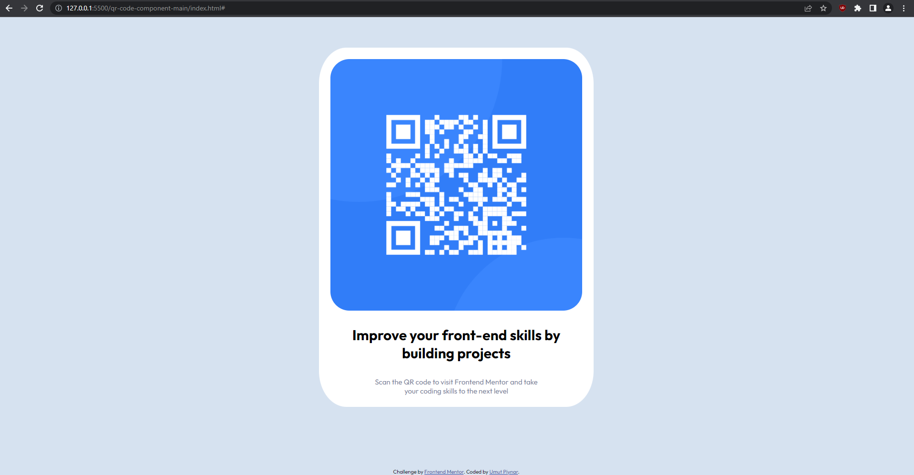

# Frontend Mentor - QR code component solution

This is a solution to the [QR code component challenge on Frontend Mentor](https://www.frontendmentor.io/challenges/qr-code-component-iux_sIO_H). Frontend Mentor challenges help you improve your coding skills by building realistic projects. 

### Screenshot

### Links

- Solution URL: https://github.com/uruskan/FEMSolutions
- Live Site URL: https://uruskan.github.io/FEMSolutions/

### Built with

-HTML5
-CSS
-FLEXBOX

### What I learned

All I learned is no matter how many tutorials you finished, when you are presented with a challenge even a very basic one it takes you some time.
I'm not going into technical stuff in this one.

## Author

- Website - None
- Frontend Mentor - [@uruskan](https://www.frontendmentor.io/profile/uruskan)

